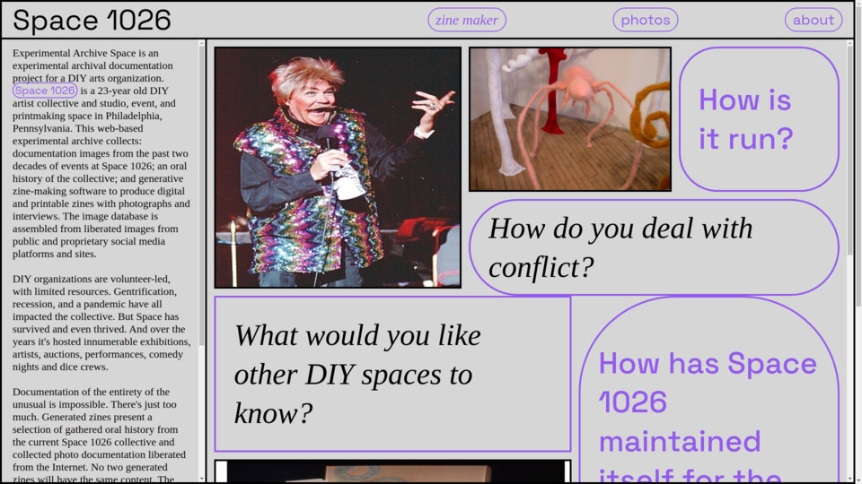
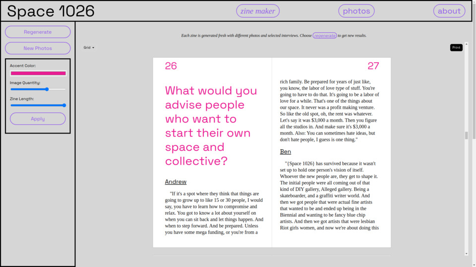
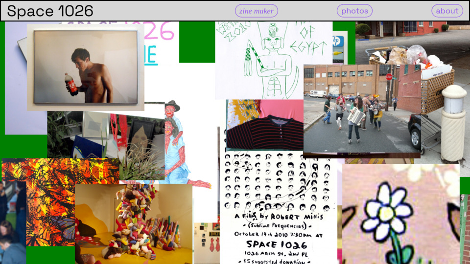
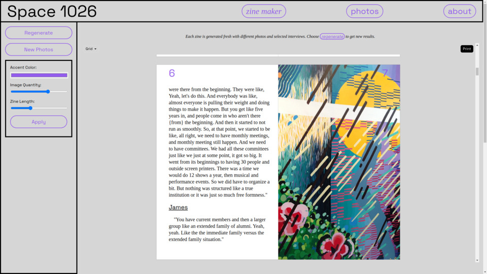

# archiving-artist-spaces

## Artist-Run Spaces Archiving Project

An archival project to preserve images, oral history and activity of precarious artist-run spaces

### Description 

Artist-run spaces, also called DIY Spaces or Alternative Spaces are creative communities operating on the margins of cultural institutions. They exist in a precarious space, currently affected by the economy, pandemic, and gentrification. Many shuttered during the pandemic. Others have struggled to make rent.

While artist-run communities of earlier eras are documented through photographic prints, video, and publications, these recent communities are primarily promoted and documented online, on closed proprietary platforms, with an emphasis on immediacy but not on long term archiving. The archive of their creative activities are in danger of disappearing in the short term as websites go down, platforms close or change their business plan.

Lee Tusman is an educator, researcher, programmer and artist-organizer at artist-run spaces in New York City. Lee is currently working on a pilot project with DIY artist-run spaces in multiple cities, both current and recently closed during the pandemic, to archive their artistic activity, website, photo archives, based on his experience and programming knowledge. The goal: creating a toolkit and software to create archives of rescued photo documentation and websites, new oral history interviews, and photogrammetry capture.

## Devlog

[devlog - my activity development log](devlog.md)

## Next Steps:

* Expand partnering organizations. Conduct interviews, assess their practices, help identify and build their archive through free open source software tools 
* Create a toolkit of best practices to be shared with artist organizations, presented online (website and youtube tutorial) and offer workshops 
* Create software toolkit of open source software these organizations can use (in progress)
* Secure funding for developing these tools, building website with documentation, assist in costs for travel, and to pay honorariums
* Secure an institutional partner(s) to serve as long term care takers of these archives 

### Links

[Experimental Archive Space for Space 1026](http://experimentalarchive.space)

[Artists in the Archive - ITP Spring 2019 course taught by Jer Thorp](https://github.com/blprnt/ArtArchive) (GitHub Repository, 2019)

[What Do you Mean by Archive? Genres of Usage for Digital Preservers](https://blogs.loc.gov/thesignal/2014/02/what-do-you-mean-by-archive-genres-of-usage-for-digital-preservers/) (Library of Congress Blog, 2014)  

### Screenshots

[Raid the Icebox I was an artist-curated exhibit by Andy Warhol at the RISD Museum. While not a direct reference, it partly inspires my archival work here.](https://risdmuseum.org/exhibitions-events/exhibitions/raid-icebox-1-andy-warhol)  

